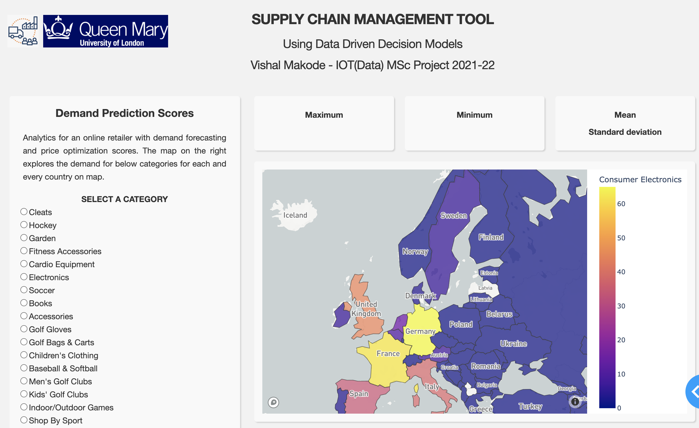
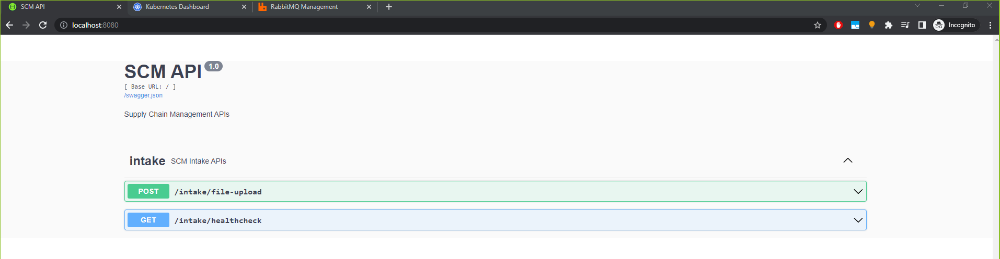

# supply-chain-orchestration Tool
Innovating and solving multiple supply chain challenges by using right combination of technologies

# About supply-chain-orchestration Tool
This README provides a rundown of SCM - tool a thesis project from *Vishal Makode - QMUL IOT(Data) 2020-22*
  

## The app in a nutshell:
Supply-chain-orchestration App is tailored for supply chain managers. To aid them in orchestrating and organising supply chain with real time insights. The web app uses REST based APIs to display insights on a dashboard and use a ML based prediction algo as in a business logic service.

## How the app runs:

* At the backend, the code for the apps functionality is written in Python. 
* Pythons micro framework Flask is also used.
* The application uses MongoDB database for accessing persistent information.
* Support for Cloud Scalability, deploying in a container environment.
* Uses pydash for dashboarding


## Site
Few snapshots of individual pages with their descriptions.

### Landing Page


### Data Exploration Page 

An overview of open correlation matrix heat map.

### Plotter Page 

An overview of open correlation matrix heat map.


## Setup and Launch
The application uses a mono-repo with multiple packages. To install and initialize all the packages on a local development environment, including running a docker image for the DB and seeding the DB, execute the following commands in the project root folder:


```jsx
pip install -r src/setup/requirements.txt
python src/run.py
```

## Its recommended to use a virtual environment (optional)
```jsx
make env-setup
make run-local # To run on local
```


## Architecture


## API end point and Kubernetes cluster screen-grab




## Mobile support
The Web App is compatible with devices of all sizes and all OSs, and consistent improvements will be made.

### Development
Want to contribute? Great!

To fix a bug or enhance an existing module, follow these steps:

- Fork the repo
- Create a new branch (`git checkout -b improve-feature`)
- Make the appropriate changes in the files
- Add changes to reflect the changes made
- Commit your changes (`git commit -am 'Improve feature'`)
- Push to the branch (`git push origin improve-feature`)
- Create a Pull Request 

### Bug / Feature Request
If you find a bug (the website couldn't handle the query and / or gave undesired results), kindly open an issue by including your search query and the expected result.

If you'd like to request a new function, feel free to do so by opening an issue Please include sample queries and their corresponding results.


## Built with 
* [HTML](https://developer.mozilla.org/en-US/docs/Web/HTML) 
* [CSS](https://developer.mozilla.org/en-US/docs/Web/CSS) 
* [Python](https://docs.python.org/3/)
* [Flask](http://flask.pocoo.org/docs/1.0/)
* [Docker](https://docs.docker.com/)
* [Kubernetes](https://kubernetes.io/docs/home/)s
* [MongoDB](https://www.mongodb.com/docs/) 


## To-do
- Integrate learning 


MIT © 

